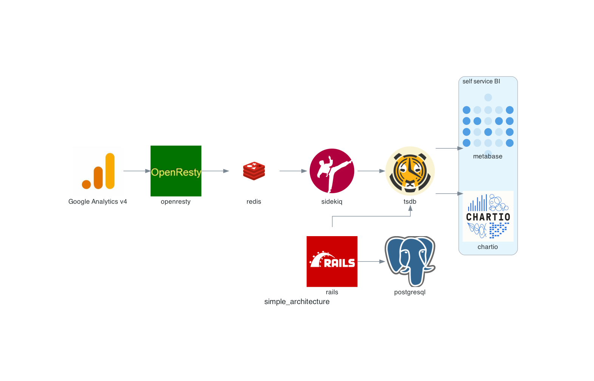
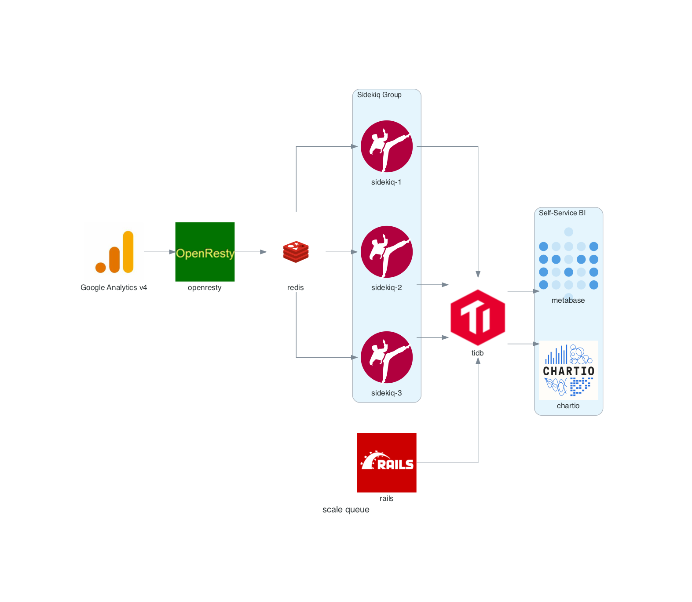
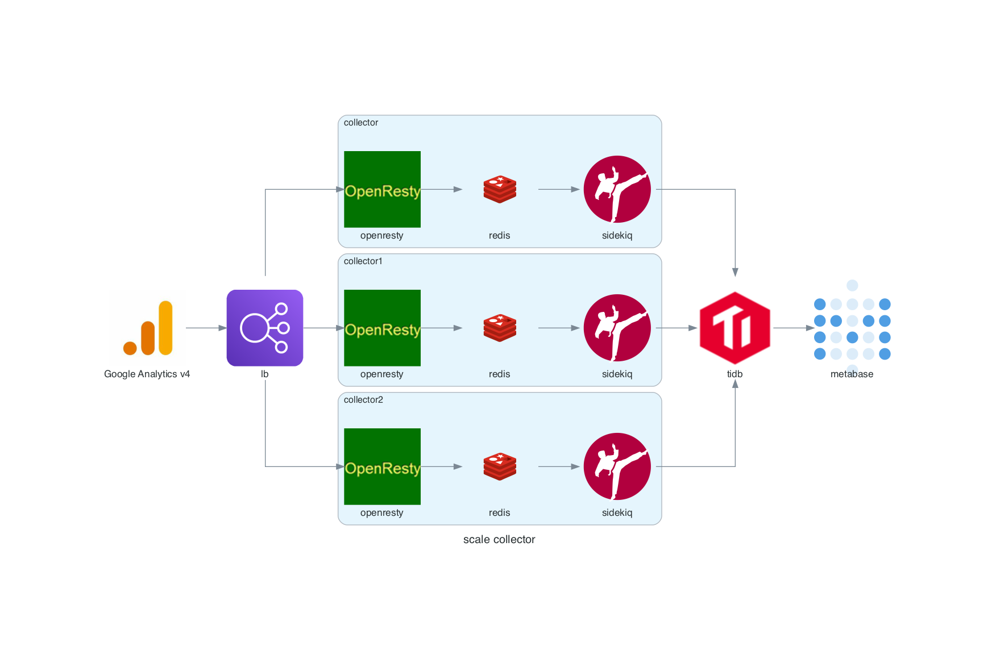

# Hypercable Analytics

Hypercable Analytics is a fully featured high performance scalable alternative to Google Analytics, build with timescaledb openresty redis and rails.

## Benchmark

### collector

Hypercable collector can handle 25k requests per second on the 8c32g vultr server, and the availability is 100%.

```
siege -R <(echo connection = keep-alive) -c50 -b -t 50S  'http://10.40.96.5:8000/c7f4edce-58c3-4917-8f18-a2ea6c1b93dc/g/collect?en=page_view&v=2&tid=G-JEX4JP2G1E&gtm=2oe161&_p=1322479532&sr=1440x900&ul=zh-cn&cid=1162070685.1609784219&dl=https%3A%2F%2Fhypercable.github.io%2Fsite%2F%3Fto%3Dget-start&dr=https%3A%2F%2Fhypercable.github.io%2Fsite%2F%3Fto%3Dlearn-more&dt=ga%20test&sid=1611145231&sct=34&seg=1&_s=1'   \
-H 'user-agent: Mozilla/5.0 (Macintosh; Intel Mac OS X 10_14_5) AppleWebKit/537.36 (KHTML, like Gecko) Chrome/87.0.4280.141 Safari/537.36'   \
-H 'content-type: text/plain;charset=UTF-8'   \
-H 'accept: */*'   \
-H 'origin: https://hypercable.github.io'   \
-H 'referer: https://hypercable.github.io/'   \
-H 'accept-language: zh-CN,zh;q=0.9,en;q=0.8,zh-TW;q=0.7'   \
-A 'Mozilla/5.0 (Macintosh; Intel Mac OS X 10_14_5) AppleWebKit/537.36 (KHTML, like Gecko) Chrome/89.0.4389.90 Safari/537.36'a
** SIEGE 4.0.4
** Preparing 50 concurrent users for battle.
The server is now under siege...
Lifting the server siege...
Transactions:            1236030 hits
Availability:             100.00 %
Elapsed time:              49.41 secs
Data transferred:           0.00 MB
Response time:              0.00 secs
Transaction rate:       25015.79 trans/sec
Throughput:             0.00 MB/sec
Concurrency:               49.40
Successful transactions:     1236030
Failed transactions:               0
Longest transaction:            0.04
Shortest transaction:           0.00
```

## Diagram

### Simple Architecture



### Scale Queue



### Scale Collector



## screenshot


## local setup

* env: cp .env.example.docker .env
* build: docker-compose build
* start: docker-compose up
* stop: docker-compose stop
* run migration: docker-compose run rails rake db:migrate
* collcetor location: http://localhost:8000
* open http://localhost:3333


## production setup

* git clone 
* edit .env.production
* docker-compose -f docker-compose.production.yaml run rails  rake db:migrate
* docker-compose -f docker-compose.production.yaml up -d --scale sidekiq=6
* git pull && docker-compose -f docker-compose.production.yaml pull
* docker-compose -f docker-compose.production.yaml logs --tail="100"

## demo site

* https://learnsql.io （Note: demo project, data will be cleared later）
* https://hackershare.dev (site with hypercable analytics tracker installed)
